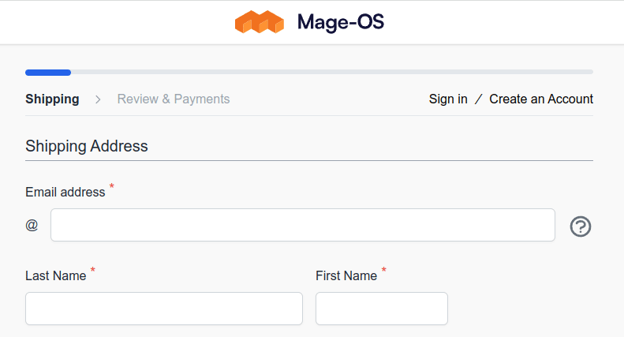

# Yireo HyvaCheckoutProgressBar

This Magento 2 module adds a small progress bar in the top of the Hyva Checkout, that progresses for every field that is filled in. The literal progress is not shown - the numbers are not important. Instead the progress bar is only meant as a visual indicator.

**This module is abandoned and no longer maintained. We have moved to our new [LokiCheckout](https://loki-checkout.com/) instead.**


### Installation
```bash
composer require yireo/magento2-hyva-checkout-progress-bar
bin/magento module:enable Yireo_HyvaCheckoutProgressBar Yireo_HyvaCheckoutUtils
```



